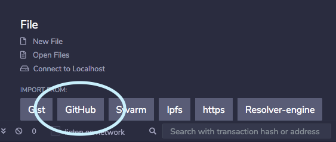

# will-and-trust-smart-contracts
Solidity smart contracts that performs the basic functions of a will and trust.

### [Will and trust deployer contract](./WillAndTrustDeployer.sol)

In this implementation, new will and trust contracts are deployed ad hoc using a single existing deployer contract. The `WillAndTrustDeployer` is (would be) deployed once on-chain and users who wished to create a will or trust would interact with the deployer contract to create their will(s) and trust(s).

### [Simple will contract](./SimpleWill.sol)

This contract allows the owner (a benefactor or power of attorney) to store funds in a will and add beneficiaries who can withdraw the funds after the will has been activated. 

After the contract is deployed, the owner has the following functions available through the interface:

* add beneficiaries

* deposit funds

* activate will

* change owner

Beneficiaries are added using their addresses, one at a time.

Funds can be added as many times as wanted. The exception is that after the will has been activated - meaning the funds are available for withdrawal by the beneficiaries - funds can no longer be deposited. This makes sense from a practical standpoint, but also it avoids any complicated logic in the case where some beneficiaries have withdrawn funds already and others have not (meaning the allocation would need to be recalculated with that in mind).

There are a number of checks to ensure that relevant functionality is only available to the owner or the beneficiary making a call.

### [Simple trust contract](./SimpleTrust.sol)

The trust contract is slightly different from the will contract. While a will can have many beneficiaries, a trust can have exactly one beneficiary; while a will must be activated by the owner, a trust is created with an unlock time, after which the funds may be withdrawn.

### How to use

The easiest way to try out these contracts is to import them in [Remix](https://remix.ethereum.org). 

To follow the intended use flow, first import and deploy `WillAndTrustDeployer.sol`, find that contract under "Deployed Contracts" and then use the `createWill` and `createTrust` public functions to create will and trust contracts.